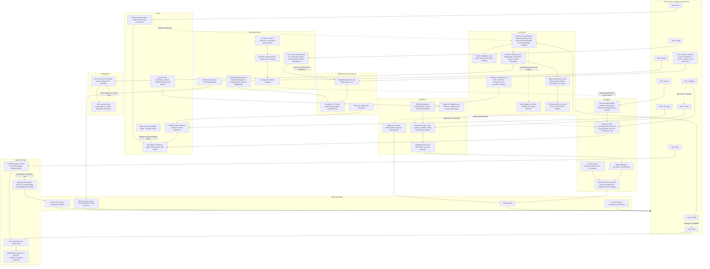

# P-DADA planning anchor graph

Solid arrows ground or extend; dotted arrows are counterpoints. Copy labels exactly. Status classes for a live graph:
`visited`, `kept`, `adapted`, `scrapped`.

```mermaid
flowchart TB
  subgraph STRATEGY["STRATEGY"]
    kernel["Kernel of Good Strategy: diagnosis, guiding policy, coherent action (Rumelt, Good Strategy Bad Strategy)"]
    badstrat["Bad strategy: fluff, goals mistaken for strategy (Rumelt)"]
    wardley["Wardley Mapping: value chain and evolution (Simon Wardley)"]
    disrupt["Disruptive innovation and Jobs to Be Done (Christensen, The Innovator's Solution)"]
    canvas["Business Model Canvas (Osterwalder and Pigneur, Business Model Generation)"]
    platform["Platform Revolution: multi-sided networks (Parker, Van Alstyne, Choudary)"]
    chicken["Cold start problem (Andrew Chen, The Cold Start Problem)"]
  end
  subgraph PRODUCT["PRODUCT"]
    wb["Working Backwards PR/FAQ (Bryar and Carr, Working Backwards)"]
    inspired["Product discovery: value, usability, feasibility, viability risks (Cagan, Inspired)"]
    shapeup["Shape Up: appetite, bets, fixed time variable scope (Singer, Basecamp)"]
    okr["Objectives and Key Results (Doerr, Measure What Matters)"]
    mvp["Validated learning and MVP (Ries, The Lean Startup)"]
  end
  subgraph ARCH["ARCHITECTURE"]
    c4["C4 model: context, containers, components (Simon Brown)"]
    adr["Architecture Decision Records (Nygard)"]
    ddd["Bounded contexts (Evans, Domain-Driven Design)"]
    ddia["Reliability and consistency trade-offs (Kleppmann, Designing Data-Intensive Applications)"]
    conway["Conway's law (Melvin Conway)"]
    policycode["Code is law: rules enforced by architecture (Lessig, Code and Other Laws of Cyberspace)"]
  end
  subgraph DELIVERY["DELIVERY"]
    brooks["No silver bullet; adding people to a late project (Brooks, The Mythical Man-Month)"]
    refclass["Reference class forecasting; think slow, act fast (Flyvbjerg, How Big Things Get Done)"]
    accelerate["Four key metrics (Forsgren, Humble, Kim, Accelerate)"]
    dod["Definition of Done and exit criteria (Schwaber and Sutherland, Scrum Guide)"]
    walking["Walking skeleton (Cockburn, Crystal Clear)"]
  end
  subgraph RISK["RISK"]
    premortem["Premortem (Gary Klein, Performing a Project Premortem)"]
    blackswan["Black swans and fragility (Taleb, The Black Swan)"]
    stride["STRIDE threat modeling (Shostack, Threat Modeling)"]
    cynefin["Cynefin: clear, complicated, complex, chaotic (Snowden and Boone)"]
    register["Risk register: likelihood, impact, owner, trigger (ISO 31000)"]
  end
  subgraph COMPLIANCE["COMPLIANCE AND TRUST"]
    licence["Regulated perimeter: who holds which licence"]
    pfmi["Principles for Financial Market Infrastructures (CPMI-IOSCO)"]
    privacy["Privacy by design (Ann Cavoukian)"]
  end
  subgraph ECON["ECONOMICS"]
    unit["Unit economics from stated inputs (computed, not asserted)"]
    pricing["Value-based pricing (Ramanujam and Tacke, Monetizing Innovation)"]
  end
  subgraph PRES["PRESENTATION"]
    pyramid["Pyramid Principle: answer first, MECE support (Barbara Minto)"]
    krug["Don't Make Me Think (Steve Krug)"]
    tufte["Data-ink and evidence (Tufte, The Visual Display of Quantitative Information)"]
    dadadesign["DADA design graph for the plan site (references/design-graph.md)"]
  end
  subgraph CRITICS["CRITICS (one subagent per reference)"]
    crit_rumelt["Critic: Rumelt"]
    crit_minto["Critic: Minto"]
    crit_klein["Critic: Klein"]
    crit_krug["Critic: Krug"]
    crit_brooks["Critic: Brooks"]
    crit_nygard["Critic: Nygard"]
    crit_shostack["Critic: Shostack"]
    crit_flyvbjerg["Critic: Flyvbjerg"]
    crit_cagan["Critic: Cagan"]
    crit_lessig["Critic: Lessig"]
    crit_omitted["Critic: the party the plan leaves out (Rawls, A Theory of Justice: veil of ignorance)"]
  end
  subgraph METHOD["PANEL METHOD"]
    claimaudit["Claim audit: sourced, computed or labelled"]
    decaudit["Decision audit: options, recommendation, decide-by, owner"]
    exitaudit["Exit-test audit"]
    consistency["Cross-document consistency and glossary"]
  end

  kernel --> wardley
  kernel --> canvas
  kernel -.->|counterpoint: goals are not strategy| badstrat
  badstrat -.-> okr
  disrupt --> wb
  canvas --> unit
  canvas --> platform
  platform --> chicken
  chicken -.->|liquidity before features| inspired
  wb --> inspired
  inspired --> mvp
  mvp --> walking
  shapeup -.->|fixed time vs. fixed scope| refclass
  okr --> exitaudit
  c4 --> ddd
  ddd --> conway
  conway -.->|team shape becomes system shape| brooks
  adr --> decaudit
  ddia --> pfmi
  policycode --> licence
  policycode -.->|rules in code still need a legal owner| licence
  licence --> pfmi
  privacy --> stride
  brooks --> refclass
  refclass --> register
  accelerate --> dod
  dod --> exitaudit
  walking --> dod
  premortem --> register
  premortem -.->|attack the boldest bet| kernel
  blackswan -.->|registers miss what nobody listed| register
  stride --> register
  cynefin --> shapeup
  unit --> pricing
  pricing -.->|value to payer vs. cost to serve| unit
  pyramid --> krug
  krug --> dadadesign
  tufte --> claimaudit
  pyramid -.->|answer first vs. evidence first| tufte
  claimaudit --> CRITICS
  decaudit --> CRITICS
  exitaudit --> CRITICS
  consistency --> CRITICS
  crit_rumelt --> kernel
  crit_minto --> pyramid
  crit_klein --> premortem
  crit_krug --> krug
  crit_brooks --> brooks
  crit_nygard --> adr
  crit_shostack --> stride
  crit_flyvbjerg --> refclass
  crit_cagan --> inspired
  crit_lessig --> policycode
  crit_omitted --> licence
  crit_rumelt -.->|strategy vs. readability| crit_krug
  crit_flyvbjerg -.->|plan slow vs. ship fast| crit_cagan
```
